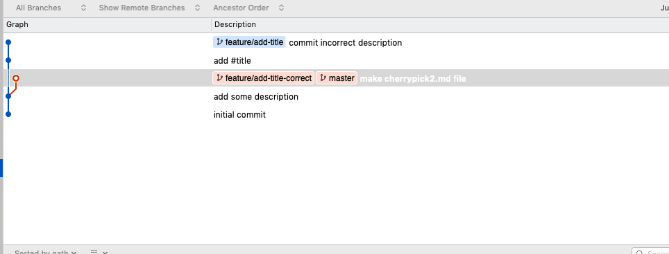

다른 개발자와 협업하다가 브랜치가 여기저기 꼬여서  
도저히 내 코드를 살릴 수 없는 상황이 되었나요?

`rebase`또는`merge`를 해야하는데 컨플릭트를  
어디서부터 어떻게 해결해야 할지 감이 안 오나요? 😟


## 협업하면서 당면하는 문제들

열심히 `feature`를 만들어서 `pull-request` 를 보냈지만 시작시점부터 설계를 잘못했거나  
코드베이스를 잘못 이해해서 리셋을 통해 아예 새로 시작하는 마음으로 `pull-request`를 보내야 하는 경우가 있습니다. (좌절…)


> 아까운 내 코드들...ㅠㅠ

이런경우 내가 이전에 작성한 코드를 모두 날리지 않고 제대로 작성된 코드(커밋)를 선택적으로 가져올 수 있다면 좌절감이 좀 덜 할 수 있을 것 같은데요…  
이런 경우에 유용한 `cherry-pick commit` 에 대해서 알아보기 위해 다음처럼 상황을 가정해보겠습니다


`feature`브랜치의 최종커밋을 보니 다음처럼 잘못된 내용을 커밋했네요

```diff
+ feature 브랜치에서 다음처럼 잘못된 커밋을 했습니다.
+  -체리픽 커밋은 다른 브랜치를 내가 작업한 브랜치로 합치는 커밋이랍니다!!
+
```

보통의 경우라면 이 부분을 수정하거나 삭제하고 다시 커밋을 하겠지만  
`conflict`등의 여러가지 복잡한 경우가 있다고 가정하고  
작성의도에 맞게 `cherry-pick`커밋을 활용해 보겠습니다

먼저 이전 브랜치는 남겨둔 채 다음처럼 `master`브랜치에서  
`feature/add-title-correct` 브랜치를 새로 만든 다음 `checkout`하고



`git cherry-pick`명령어를 통해 내가 원하는(올바른) 커밋만 가져 오겠습니다  
커밋내용은 `git cherry-pick`을 터미널에 입력한 뒤 `tab`을 눌러  
현재 브랜치에서 가져올 수 있는 커밋들을 자동완성 된 히스토리를 통해 볼 수 있습니다

`(b8ffcad) add #title` 은 `#체리픽이란` 이라는 텍스트만 추가한 커밋이고  
올바른 커밋이니 가져가겠습니다

```shell
(feature/add-title-correct) % git cherry-pick b8ffcad

HAED                  feature/add-title                master
ORIGIN_HEAD           feature/add-title-correct

59924ff   -- [59924ff] commit incorrect description (23minutes ago)
b8ffcad   -- [b8ffcad] add #title (27minutes ago)
```

```shell
git cherry-pick b8ffcad(가져 가고 싶은 커밋넘버)
```

명령어를 실행하고 히스토리를 보니 내가 원하는 커밋이  
새로운 브랜치에서 정상적으로 들어온 것이 보입니다


단순하고 간단한 예시지만 `cherry-pick commit`의 유용성이 느껴지시나요?👍

이후에는 새로 만든 브랜치에서 다시 `pull-request`를 보내도 되겠지만  
원격으로(GitHub 등) 이미 보낸 `request`를 `close`하고  
다시 새로운 요청을 만드는 것은 번거롭고 깔끔하지 못한 방법이므로  
기존 브랜치로 `checkout` 한 뒤 새로운 브랜치에 `reset` 해보겠습니다

```shell
git checkout feature/add-title
git reset feature/add-title-correct --hard
```

여기서 `--hard` 옵션이 없을 경우 기존 브랜치에서 작업한 내용들이  
`unstaged`된 채 남아 있으니 필요한 경우가 아니라면 옵션을 추가 하는 것이 좋습니다

```shell
(feature/add-title) % git reset feature/add-title-correct --hard
HEAD is now at 3981811 add #title
```

이렇게 된다면 내가 원하는 커밋은 `feature/add-title-correct`에서 이미 모두  
커밋이 된 상태이므로 추가적으로 원하는 내용을 수정하거나 추가한 뒤  
같은 브랜치에서 `pull-request`를 보낼 수 있겠네요!

<i>추가: 소스트리 같은 git gui툴을 사용한다면 다음처럼 커밋에서 우클릭 하고  
`cherry pick`을 클릭해서 실행 할 수도 있습니다</i>


## 최종결과


```shell
git diff master
```

```diff
+# 깃 체리픽(Git cherry pick)
+
+ 깃 체리픽에 대해서 제대로 된 설명을 넣어서 커밋해 봅시다!
+  - 깃 체리픽은 원하는 브랜치를 해당하는 커밋 내용만 반영, 업데이트 할 수 있는 기능입니다 !
+
```

지금까지 특별한 경우가 아닌 이상 잘 쓰지 않는 기능이지만  
알아두면 개발자들의 고생을 많이 줄여줄 수 있는  
`cherry-pick`에 대해서 알아봤습니다

감사합니다 🙃
