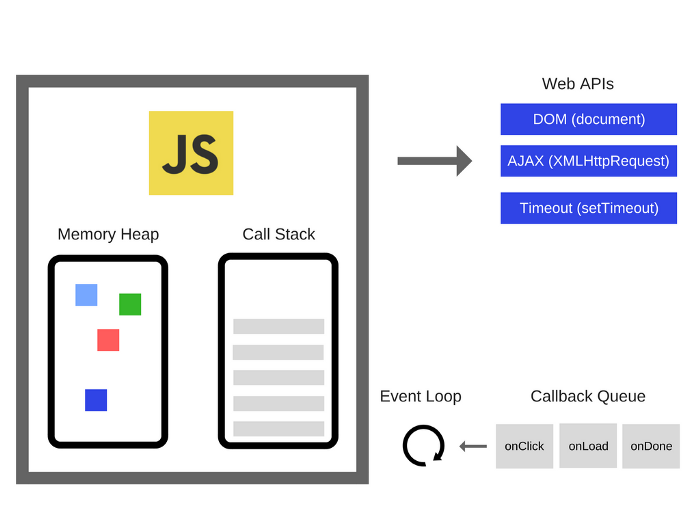

많은 분들이 알다시피 javacrtipt는 싱글스레드 환경에서 구동되는 언어입니다. 하지만 자바스크립트에서는 이벤트루프라는 매커니즘을 동작시켜 여러개의 비동기 함수와 즉시실행되는 함수를 일정한 조건과 순서에 맞게 실행해 마치 여러개의 스레드가 동작하는 것처럼 보입니다.

그러면 다음 그림을 보고 전체적인 구조를 봅시다

> 이미지 출처: https://blog.sessionstack.com/how-does-javascript-actually-work-part-1-b0bacc073cf

왼쪽 박스 안은 `자바스크립트엔진` 이며 다음으로 구성 되어 있습니다

### 자바스크립트엔진

1. memory heap
   - 변수와 함수사용을 위한 메모리가 할당되는 영역
2. call stack
   - 코드실행이구문이 말그대로 stack으로 쌓이는 곳
   - LAST IN FIRST OUT (FIFO) 방식으로 실행
   - 자바스크립트가 싱글스레드라고 불리는 이유는 콜스택이 하나이기 때문

`자바스크립트엔진` 외부에는 `Web APIs` & `Callback Queue` & `Event loop`가 있습니다.

### Web APIs
