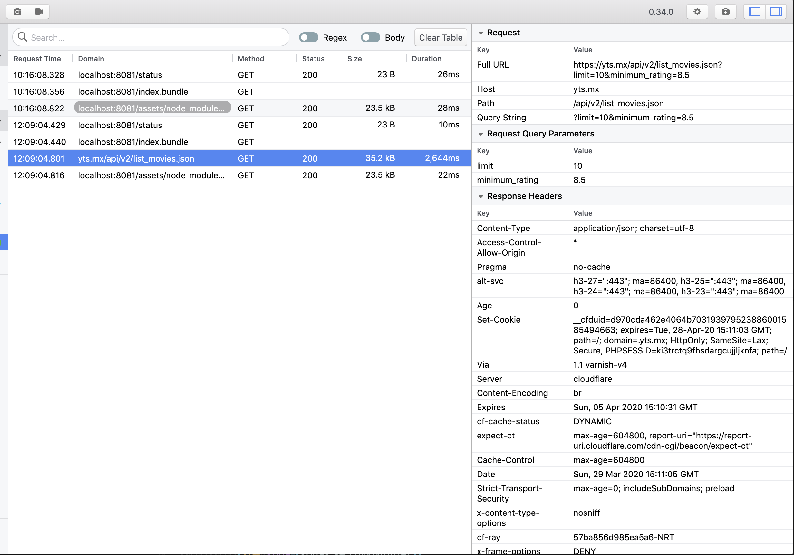

Flipper는 iOS Android React-Native 에서 사용할수 있는 디버깅툴입니다. React-Native에서 디버그는 다소 시간이 걸리고 귀찮은 일인데요 이 도구를 사용한다면 비교적 쉽게 앱을 디버깅 할 수 있습니다. 여기서는 Flipper를 사용해서 React Native를 편하게 개발할 수 있는 방법에 대해서 알아보겠습니다

# 설치하기

React Native 0.62가릴리즈 되었습니다(2020.03.27.).React-Native 0.62부터는 플리퍼를 기본적으로 사용할 수 있도록 설정이 모두 되어 있으니 공식홈페이지에서 Desktop App을 설치 하시기만 하면 됩니다 👍

설치링크: https://fbflipper.com

혹시 0.62버전 미만에서 Flipper를 사용하시기 원한다면 [공식문서 설치 방법](https://fbflipper.com/docs/getting-started.html#setup-your-react-native-app)을 참고해서 설정을 완료해주세요

# console.log

플리퍼를 사용하면 더이상 log를 크롬 디버그 창에서 확인 하지 않아도 됩니다.

```js
React.useEffect(() => {
  console.log('이제 더이상 로그를 크롬 디버그창에서 확인하지 않아도 됩니다!')
}, [])
```


위 사진에서 확인한 것처럼 디버그 모드를 켜지 않더라고 바로 `React Native` 섹션 아래 `Logs`에서 로그를 확인할 수 있습니다. 자바스크립트에서 찍은 로그만 확인하기 위해서는 Tag를 `client_log` 로 선택하시면 됩니다

# Network inspector

플리퍼 섹션아래 `Network`플러그인을 확인하면 서버와의 통신도 쉽게 할 수 있습니다 다음 api를 테스트용으로 호출 해보겠습니다

`https://yts.mx/api/v2/list_movies.json?limit=10&minimum_rating=8.5`

```js
React.useEffect(() => {
  fetch('https://yts.mx/api/v2/list_movies.json?limit=10&minimum_rating=8.5')
    .then(res => res.json())
    .then(result => console.log(result))
}, [])
```



플리퍼에서는 위 사진처럼 내가 호출한 URL을 클릭하면 `쿼리스트링`, `리스폰스 헤더`, `리스폰스 바디` 정보를 아주 보기 편하게 보여줍니다.


> 깔끔한 Response body

# Layout

React Native에서는 이미 다음처럼 `show inspector`라는 기능을 통해서 레이아웃을 확인할 수 있는 기능을 제공해주고 있었습니다


자세한 뷰의 스펙을 확인하기에는 좋았지만 웹에서 사용하는 css 처럼 실시간으로 값을 바꿔가면서 바뀐 UI를 수정할 수는 없었는데요 플리퍼의 `Layout` 플러그인을 사용하면 어느정도 이 답답함을 해결 할 수 있습니다

### iOS에서 레이어 디자인 변경해보기


### Android에서 뷰 디자인 변경해보기


# 아쉬운점

플리퍼라는 도구 자체가 출시된지 그리 오래되지 않았고, React Native를 아직 완벽하게 지원하지 못하기 떄문에 여기저기 아쉬운점도 많이 보입니다.

1. 플랫폼간 Layout 컨트롤의 차이  
   이 부분은 아마도 React Native와 각 플랫폼의 레이아웃이 연결되는 부분에 따른 차이인거 같은데, iOS에서는 레이어라고 해서 배경색을 바꾸거나 하는것이 되었지만, 안드로이드는 그게 안되었고 반대로 iOS에서는 Text를 바꾸거나 색을 바꾸는 것이 안됐지만 안드로이는 정상적으로 동작 했습니다.
2. React Native를 위한 플러그인이 부족  
   Redux 연동을 위한 플러그인이 없어 평소에 Redux-devtools를 편하게 사용하신 분이라면 다소 불편함이 있을 것 같습니다 (현재 플러그인 리스트에 있는건 Flutter용) 이것 말고도 마땅히 필수 플러그인이라고 설치할만 것들이 없는 것 같습니다. 플러그인 리스트는 https://www.npmjs.com/search?q=flipper-plugin 에서 확인 가능합니다.
3. 데스크탑 앱 UI가 가끔씩 꺠짐
   화면을 이리저리 옮겨다니고 Collapsable menu를 사용하다보면 가끔 UI가 꺠지는데 원래대로 돌아오지 않아 앱을 껏다가 켜야 하는 경우가 있었습니다.

# 결론

더 이상 느린 크롬 디버그창을 보지 않아도 되는건 일단 저에게 가장 큰 행복인 것 같습니다. 하지만 리덕스를 활발하게 써야 한다면 Redux devtools 을 켜기 위해서 어쩔 수 없이 debug모드를 켜야겠네요..ㅠㅠ(빨리 플러그인이 나왔으면 좋겠습니다) 추가적으로 네트워크(통신) 상태를 자세하게 볼수 있는 Network 플러그인은 정말 유용하게 사용 할 수 있겠네요. 아직까지 실제로 사용해보지 않아 무슨 불편함이 더 나올지는 모르겠지만, 플리퍼는 React Native 개발자들에게 정말 유용한 도구가 되리라 생각합니다 👍
