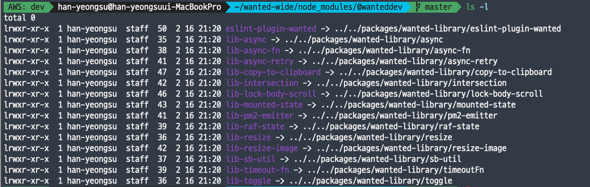

<i>다음은 회사 블로그에 작성한 글을 옮긴 포스팅입니다</i>

원티드 프론트엔드 팀의 인원이 늘어나고 목적 단위의 스쿼드팀이 늘어나면서 서로의 프로젝트에서 동일/비슷한 코드를 계속 작성하고 이를 공유 해야 하는 상황이 지속해서 생겨났습니다.
이 문제를 해결하기 위해 공통으로 발생하는 코드를 wanted-wide 라는 프로젝트명으로 모두 모듈화하여 중앙화해서 사용하기로 결정하였고 Lerna와 yarn workspaces를 활용해서 효율적으로 모노레포 시스템을 구현할 수 있었습니다.
아래에서 그 내용을 정리하고자 합니다. 🙂

## 1. 모노레포

쉽게 얘기하자면 monorepo의 반대 개념은 multirepo입니다

- multirepo는 대부분의 프로젝트에서 사용되는 방법으로 별도의 프로젝트를 진행하거나 모듈을 만들고 관리하기 위해서 새로운 레퍼지토리를 생성하고 공통으로 쓰는 패키지도 각각 레퍼지토리별로 설치해야 하는 방식입니다.

- monorepo는 두 개 이상 프로젝트(모듈)를 하나의 레퍼지토리에서 관리하는 방법이고 공통으로 쓰는 패키지들을 공유해서 관리할 수 있는 방법입니다.

    <div align="center">
      
      <figcaption>from https://medium.com/burak-tasci/full-stack-monorepo-part-i-go-services-967bb3527bb8
  </figcaption>
    <div>

## 1-1. 모노레포의 장점

- <strong>코드의 재사용</strong>: 여러 레퍼지토리에서 프로젝트를 진행하면 비슷한 로직을 각 레퍼지토리에서 중복 구현하는 때가 많습니다. 이런 공통 로직을 다시 작성하지 않고 공통 로직을 쉽게 공유할 수 있습니다.

- <strong>의존성 관리</strong>: 기존의 멀티레포 구조에서는 각 레퍼지토리에 prettier, tslint 등 설정에 필요한 외부 라이브러리를 를 각각 설치해야 했습니다. 하지만 모노레포에서는 각 레퍼지토리를 Cloning하고 일일이 업데이트하는 과정을 거치지 않고 공통 모든 모듈에서 사용되는 외부 라이브러리를 공유할 수 있습니다.

- <strong>단일 책임 원칙</strong>: 여러 레포에서 변경사항이 있다면 개발자는 작은 커밋으로 나눠 PR(Pull Request)을 보내는 것보다, 모든 코드를 작성하고 이에 대한 의존성을 바꾸는 방식의 작업을 선호합니다. 하지만 모노레포에서는 여러 패키지의 변경사항을 하나의 커밋과 PR로 제출할 수 있습니다. 덕분에 더 작게 나눠서 작업할 수 있죠. 다만 하나의 커밋에는 한 패키지의 변경사항만 기록하는 SRP(Single Responsibility Principle, 단일 책임 원칙)를 지켜야 합니다.

- <strong>협업</strong>: 모든 구성원이 모든 코드에 접근하기 쉽기 때문에 협업에 용이 합니다

## 2. 러나

> 큰 코드베이스를 독립적으로 버전 관리 된 패키지로 분리하면 코드 공유에 매우 유용합니다. 그러나 많은 저장소에서 변경 작업을 수행하는 것은 지저분하고 추적하기 어렵고 저장소 전체에서의 테스트는 매우 복잡합니다. 이러한 (그리고 다른 많은) 문제를 해결하기 위해 일부 프로젝트는 코드베이스를 다중 패키지 리포지토리로 구성합니다. Babel, React, Angular, Ember, Meteor, Jest와 같은 프로젝트는 단일 저장소에서 모든 패키지를 개발합니다.
> <strong>Lerna는 git 및 npm을 사용하여 다중 패키지 리포지토리를 관리하는 작업 과정을 최적화하는 도구입니다.</strong>

  <div align="center">
    
    <figcaption>from lerna official document</figcaption>
  <div>

위는 공식문서에 소개 되어있는 러나에 대한 짧은 소개글입니다.(https://lerna.js.org/)

<b>위의 글 내용처럼 모노레포의 개념을 구현한 라이브러리</b>로 `Toast UI` , `storybook` 과 같은 굵직굵직한 레퍼지토리에서도 사용중입니다.

## 2-1. 러나를 구성하는 방법

기본적으로 `Lerna CLI` 를 설치 후 `lerna init` 을 하게 되면 다음의 프로세스가 진행됩니다.

1.  루트 package.json의 devDependency에 lerna가 설치됨(만약 설치되어있지 않다면)
2.  lerna.json config 파일이 루트에 생성됨

```json
{
  "npmClient": "yarn",
  "packages": ["packages/*/*"],
  "version": "independent",
  "lerna": "3.21.0",
  "useWorkspaces": true,
  "command": {
    "publish": {
      "registry": "https://npm.pkg.github.com"
    }
  }
}
```

위를 예시로 lerna.json 키값에는 다음과 같은 속성([링크](https://github.com/lerna/lerna#lernajson))이 지정될 수 있습니다. packages로 지정한 디렉토리에는 안에는 다음처럼 실제로 관리하고자 하는 모듈들이 위치합니다.

```json
packages
└── wanted-library
    ├── copy-to-clipboard
    │   ├── README.md
    │   ├── node_modules
    │   ├── package.json
    │   ├── src
    │   │   ├── copy-to-clipboard.md
    │   │   ├── copy-to-clipboard.story.tsx
    │   │   ├── copy-to-clipboard.ts
    │   │   └── index.ts
    │   ├── tsconfig.build.json
    │   └── tsconfig.json
    ├── datetime
    │   ├── README.md
    │   ├── jest.config.js
    │   ├── node_modules
    │   ├── package.json
    │   ├── src
    │   │   ├── datetime.md
    │   │   ├── datetime.story.tsx
    │   │   ├── datetime.ts
    │   │   └── index.ts
    │   ├── tsconfig.build.json
    │   └── tsconfig.json
    ├── eslint-plugin-wanted
    │   ├── README.md
    │   ├── configs
    │   ├── index.js
    │   ├── package.json
    │   └── rules
    │       ├── no-array-includes.js
    │       ├── no-lodash-chain.js
    │       └── var-length.js
    ...
```

이렇게 packages/wanted-library 안의 모듈은 독립적으로 관리되기 때문에 각각 package.json 파일과 관련된 설정 파일을(config)을 가지고 있습니다.

<b>추가로 앞으로 설명할 `yarn workspace` 를 같이 사용하기 위해 관련된 옵션도 추가해 주었고 기본 npm 레지스트리가 아니라 깃헙 패키지에 모듈을 올리기 위해 레지스트리 위치 https://npm.pkg.github.com 도 다시 설정해 주었습니다.</b>

```json
{
  "npmClient": "yarn", // npm이 아니라 yarn을 쓸거야!
  "useWorkspaces": true, // yarn workspace를 lerna와 같이 쓸거야!
  "command": {
    // 깃헙패키지에 모듈을 올릴거야!(bootstrap 설정도 가능)
    "publish": {
      "registry": "https://npm.pkg.github.com"
    }
  }
}
```

## 2-2. 러나에서 자주 사용되는 명령어

### 1. bootstrap([링크](https://github.com/lerna/lerna/tree/main/commands/bootstrap#lernabootstrap))

각각의 패키지에 명시된 디펜던시를 설치하고 패키지들 내에서 특정 모듈이 필요로 하는 버전과 실제 모듈 버전이 동일하다면 불필요한 다운로드 없이 서로 심링크를 걸어 로컬에서 사용할 수 있게 해줍니다 ([심볼릭링크](https://ko.wikipedia.org/wiki/심볼릭_링크))

<div align="center">
    
    <figcaption>심링크가 걸리면 -> 가 표시 됩니다</figcaption>
</div>

`--hoist` 옵션(플래그)을 사용한다면 공통되는 모듈을 루트의 node_modules 로 올려서 설치하고, 만약 각각의 패키지가 서로다른 버전의 외부 디펜던시를 사용한다면 가장 많이 사용되고 있는 버전이 호이스팅 되고 관련된 경고를 보여줍니다. 호이스팅을 잘 이용한다면 다음과 같은 이점을 얻을 수 있습니다. (yarn worspaces를 설명할 때 자세히 설명합니다)

- 모든 패키지는 주어진 종속성의 동일한 버전을 사용합니다.
- GreenKeeper와 같은 자동화 된 도구를 사용하여 루트의 종속성을 최신 상태로 유지할 수 있습니다.
- 종속성 설치 시간이 줄어듭니다.
- 저장 공간이 덜 필요합니다.

### 2. version([링크](https://github.com/lerna/lerna/tree/main/commands/version#lernaversion))

마지막 커밋과 차이가 있는 패키지 (모듈)를 파악해서 버전을 올려줍니다. 이때 서로 심볼릭 링크가 걸려있는 (참조 관계에 있는)dependancy 버전까지 올려줍니다. (만약 A 모듈의 버전이 1에서 2로 올라가면 A가 dependancy로 설정되어있는 패키지 내에서 버전이 올라갑니다.)

<div align="center">
    
    <figcaption>wanteddeb/lib-sb-util의 버전을 올려주면</figcaption>
</div>

<div align="center">
    
    <figcaption>wanteddeb/lib-sb-util를 참조하고 있는 다른 모듈의 디펜던시 버전도 올라갑니다</figcaption>
</div>
<br/>

- [conventionalcommits](https://www.conventionalcommits.org/en/v1.0.0/)도 지원합니다. changelog까지 자동으로 생성해주니 팀원들끼리 breaking change를 파악하거나 수정사항을 확인할 때 유용하게 사용 될 수 있습니다.
- `lerna version patch` 와 같이 semver keyword를 사용하여 버전을 올릴 수도 있습니다.

### 3. publish([링크](https://github.com/lerna/lerna/tree/main/commands/publish#readme))

- 패키지를 레지스트리에 배포하는 데에 사용됩니다.
- 아무 `arguments`를 사용하지 않을경우 모든 패키지의 버전을 lerna.json에 명시된 버전으로 업데이트 후 배포를 진행합니다

```shell
- @wanteddev/lib-async-fn: 1.0.8 => 1.0.9
- @wanteddev/lib-async-retry: 1.0.5 => 1.0.6
- @wanteddev/lib-async: 1.0.6 => 1.0.7
- @wanteddev/lib-copy-to-clipboard: 1.0.35 => 1.0.36
...
```

- `lerna publish from-package` 를 사용할 경우 각각의 패키지의 버전과 npm 레지스트리에 실제로 배포되어있는 버전을 비교하고 차이점이 있는 패키지만 업데이트 후 배포를 진행합니다

- `lerna publish from-git` 을 사용할 경우 태그를 단 커밋에 해당하는 소스가 포함된 있는 패키지를 찾아서 업데이트 후 배포를 진행합니다

### 4.clean ([링크](https://github.com/lerna/lerna/tree/main/commands/clean))

- 모든 패키지의 노드모듈을 삭제합니다. 루트 디렉토리의 노드모듈은 삭제하지 않습니다.
- 클린빌드의 목적으로 사용할 수 있습니다.

### 5. run([링크](https://github.com/lerna/lerna/tree/main/commands/run))

- 각 패키지 package.json안에 명시되어있는 script를 실행합니다.
- `--parallel`의 옵션의 유무로 parallel하게 스크립트를 실행하거나 순차적으로 실행 할 수 있습니다.

## 3. Yarn workspaces

<div align="center">
    
    <figcaption>from official document</figcaption>
</div>
<br/>

이클립스 IDE에서 여러 프로젝트가 모여 있는 공간을 작업 공간을 워크스페이스라고 부릅니다. yarn에서 말하는 workspaces도 같은 뜻입니다. 이 워크스페이스에 있는 프로젝트들은 서로 참조하는 연관 관계를 맺을 수 있습니다.

yarn workspaces를 사용하기 위해서 루트 package.json 아래 내용을 입력합니다.

```json
{
  "workspaces": ["packages/*/*"]
}
```

별도의 라이브러리 설치가 필요 없어 손쉽게 적용할 수 있는 점이 매우 큰 장점인 것 같습니다. 👍

## 3-1. Yarn workspaces를 사용하는 방법

이렇게 설정이 끝나고 난 뒤, 프로젝트 루트에서 `yarn install` 또는 `yarn`을 실행하면 루트의 package.json안에 명시되어 있는 dependency, 그리고 각 패키지에 명시되어있는 dependency가 중복을 최대한 줄인 채 루트의 node_modules안에 `호이스팅` 되어서 설치되고 dependency로 명시 되어있는 모듈은 심링크가 걸려 npm에 배포되어있는 버전이 아니라 로컬에 있는 코드를 바로 볼 수 있게 해줍니다.

<div align="center">
    
    <figcaption>from https://classic.yarnpkg.com/</figcaption>
</div>
<br/>

예)

```json
{
  "name": "workspace-a",
  "version": "1.0.0",

  "dependencies": {
    "cross-env": "5.0.5"
  }
}
```

workspace-a

```json
{
  "name": "workspace-b",
  "version": "1.0.0",

  "dependencies": {
    "cross-env": "5.0.5",
    "workspace-a": "1.0.0"
  }
}
```

workspace-b

결과:

```shell
/package.json
/yarn.lock
/node_modules
/node_modules/cross-env
/node_modules/workspace-a -> packages/workspace-a
/workspace-a/package.json
/workspace-b/package.json
```

yarn workspaces를 쓰게 되면 모듈을 관리하는 시스템을 유지하기 위해 기존의 `yarn add some-package`가 아닌 다른 방식으로 외부 라이브러리를 설치해야 합니다.

1. 특정 패키지에 외부 라이브러리 설치

```shell
yarn workspaces awesome-package add react react-dom --dev

// awesome-package에 react와 react-dom을 devDependencies로 설치합니다.
```

2. 특정 패키지에서 외부 라이브러리 제거

```shell
yarn workspaces web-project remove some-package

// web-project에서 some-package를 제거합니다.
```

3. 루트에 외부 라이브러리 설치 (공통모듈)

```shell
yarn add some-package -W (or --ignore-workspace-root-check)

// yarn workspace를 사용하게 되면 기본적으로 패키지안에 모듈을 설치하는 것으로 간주하므로 workspace-root-check를 무시하고 설치해줍니다.
```

## 4. Lerna와 Yarn workspaces의 불편하지 않은 동거

- <strong>배포와 버전관리는 러나로 —</strong> yarn workspaces도 일부 command를 제공하긴 하지만, 여러 개의 패키지를 용이하게 관리 할 수 있는 CLI 명령어는 Lerna에서 많이 제공 되고 있습니다(publish, version 등). 위에서 설명한 commands 말고도 패키지들을 효율적으로 관리하고 배포 할 수 있는 상당히 많은 명령어를 제공하고 있는데(링크) 자동화를 위한 CI설정에서 마주칠 수 있는 다양한 상황에 대응 할 수 있는 많은 옵션들이 많아서 좋았고 관련한 이슈와 수정사항이 지속해서 개발되고 있다는 점도 Lerna를 매력적인 모노레포 매니저로 만드는 중요한 요소인 것 같습니다.

- <strong>패키지 관리는 Yarn으로 —</strong> yarn 은 npm과 함께 개발자에게 많이 사용되는 패키지 매니저입니다. npm이 모노레포를 지원하지 않는 반면에 yarn은 yarn workspaces 를 추가적인 라이브러리 설치 없이 쉬운 방법으로 제공하고 있고 속도와 안정성을 위주로 계속 개발 할것을 암시하며 개발자들의 만족감을 올려주고 있습니다. Yarn workspaces가 불필요하게 lerna bootstrap 등의 명령을 실행하지 않으면서 더 안전하고(버그없이) 깔끔하게 패키지를 관리해주므로 Lerna + yarn workspaces의 조합이 많은 개발자들에게 선택을 받는 것 같습니다.

- yarn workspaces의 장점으로 `babel` 은 lerna를 완전히 버리고 yarn workspaces를 선택했습니다.

- 러나도 yarn workspaces를 사용중입니다…😅

## 5. 참조

Lerna 공식문서 : https://lerna.js.org/

Yarn 공식문서: https://classic.yarnpkg.com/en/docs/workspaces