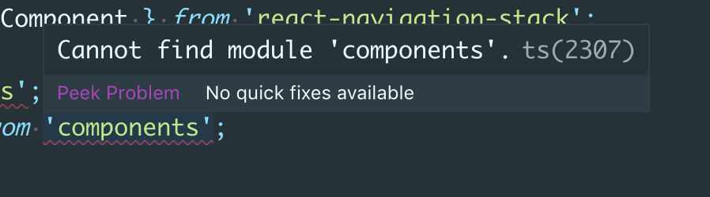

이 포스트에서는 `vscode` 에디터를 기준으로 [babel-plugin-module-resolver](https://github.com/tleunen/babel-plugin-module-resolver)를 사용해서
간편하게 모듈(내가 만든 파일)을 `import` 할 수 있는 방법을 소개합니다

```js
// Use this:
import MyUtilFn from 'utils/MyUtilFn'
// Instead of that:
import MyUtilFn from '../../../../utils/MyUtilFn'
```

[babel-plugin-module-resolver](https://github.com/tleunen/babel-plugin-module-resolver) 에서 설명하고 있는
예제입니다. 폴더와 파일들이 점점 많아지고, 작성하는 파일의 depth가 점점 깊어지면 위의 설명대로 `../../../`를 몇개써야 파일을 불러올 수 있을지
헷갈리게 되고 이는 실수를 유발 할 수 있는 가능성을 키웁니다

소스양이 많아지고 위와 같은 작업을 계속 해야 한다면 정말...

<figure>
  
</figure>

> 이거 뭐 보기에도 안좋고...

# 그럼 이제 적용해봅시다

이번에는 React Native 프로젝트를 기준으로 설명하겠습니다

먼저 [babel-plugin-module-resolver](https://github.com/tleunen/babel-plugin-module-resolver) 를 `devDependencies`에 설치합니다

<figure>
  <iframe
  src="https://carbon.now.sh/embed/?bg=rgba(0%2C0%2C0%2C1)&t=material&wt=bw&l=application%2Fx-sh&ds=false&dsyoff=20px&dsblur=68px&wc=true&wa=true&pv=56px&ph=56px&ln=false&fl=1&fm=Fira%20Code&fs=18px&lh=90%25&si=false&es=2x&wm=false&code=yarn%2520add%2520-D%2520babel-plugin-module-resolver%2520%2520%2520%2520%2520%2520%2520%2520%2520%2520%2520%2520%2520%2520%2520%2520%2520%2520%2520%2520%2520%2520%2520%2520%2520%2520%2520%2520%2520%2520%2520%2520%2520%2520%2520%2520%2520%2520%2520%2520%2520%2520%2520%2520%2520%2520%2520%2520%2520%2520%2520%2520%2520%2520%2520%2520%2520%2520%2520%2520%2520%2520%2520"
  style="width:100%; height:273px; border:0; overflow:hidden;"
  sandbox="allow-scripts allow-same-origin">
</iframe>
</figure>

다음으로는 babel 설정파일을 설정해 주면 되는데요 React Native 프로젝트에서는
다음과 같이 `babel.config.js` 파일을 설정합니다  
저는 보통 개발하는 파일을 `src`폴더 밑에 두기 때문에 아래와 같이 설정했습니다

```js
// babel.config.js
module.exports = {
  presets: ['module:metro-react-native-babel-preset'],
  plugins: [
    [
      'module-resolver',
      {
        root: ['./src'],
      },
    ],
  ],
}
```

아래 예시처럼 `alias`를 통해 내가 불러오고 싶은 이름을 커스텀하게 쓸 수도 있습니다
저는 보통 `assets`폴더는 `src`폴더 밖에 두기 때문에 아래처럼 정의하곤 합니다

```json
{
  "plugins": [
    [
      "module-resolver",
      {
        "root": ["./src"],
        "alias": {
          "underscore": "lodash",
          "icons": "./assets/icons",
          "imgs": "./assets/imgs",
          "lotties": "./assets/lotties"
        }
      }
    ]
  ]
}
```

여기까지만 적용 하더라도 내가 원하는 파일을 `../../`처럼 상대경로 설정없이 불러 올 수 있는데요  
하지만 `eslint`가 이미 설정되어 있다면 `libs`폴더가 `src`파일 밑에 있어도 아래와 같은 `lint`오류가 발생합니다. 따로 설정을 해주지 않는다면
`eslint`는 지정한 위치에 파일이 없다고 생각하겠지요

```
Unable to resolve path to module 'libs/colors'.eslint(import/no-unresolved)
```

# eslint 다시 설정하기

위 문제를 해결하기 위해 필요한 `eslint` 설정파일을 `devDependencies`에 설치 합니다

<figure>
<iframe
  src="https://carbon.now.sh/embed/?bg=rgba(0%2C0%2C0%2C1)&t=material&wt=bw&l=application%2Fx-sh&ds=false&dsyoff=20px&dsblur=68px&wc=true&wa=true&pv=56px&ph=56px&ln=false&fl=1&fm=Fira%20Code&fs=18px&lh=90%25&si=false&es=2x&wm=false&code=yarn%2520add%2520-D%2520eslint-plugin-import%250Ayarn%2520add%2520-D%2520eslint-import-resolver-babel-module%2520%2520%2520%2520%2520%2520%2520%2520%2520%2520%2520%2520%2520"
  style="width:100%; height:273px; border:0; overflow:hidden;"
  sandbox="allow-scripts allow-same-origin">
</iframe>
</figure>

그리고 `.eslintrc.js` 파일에 아래와 같이 추가합니다

```diff
settings: {
    'import/extensions': ['.js', '.jsx', '.ts', '.tsx'],
    'import/parsers': {
      '@typescript-eslint/parser': ['.ts', '.tsx'],
    },
    'import/resolver': {
+   'babel-module': {},
      node: {
        extensions: ['.js', '.jsx', '.ts', '.tsx', '.native.js'],
      },
    },
  },
```

파일이 자바스크립트라면 위 내용만 설정해도 `lint` 오류 없이 코딩을 시작 할 수 있지만
만약 타입스크립트를 사용한다면 위 설정 뒤에도 에러메세지가 사라지지 않습니다

<figure>
  
</figure>

# tsconfig 다시 설정하기

확장자가 `.ts` 또는 `.tsx`인 경우 `vscode`에서는 `tsconfig.json`파일을 기준으로 에러메세지를 보여주기 때문에
아래와 같이 `compilerOptions`의 `baseUrl`을 다시 설정해야 합니다

`babel.config.js`의 `root`와 동일하게 `baseUrl`을 설정

```diff
{
  "compilerOptions": {
+   "baseUrl": "./src",
    "esModuleInterop": true,
    "jsx": "react",
    "lib": ["es6"],
    "moduleResolution": "node",
    "noEmit": true,
    "strict": true,
    "target": "esnext",
    "module": "commonjs",
    "removeComments": true
  },
  ...
}
```

# 그래도 에러가 사라지지 않는다면

- ### node서버를 리셋 후 재시작 합니다
  babel 설정파일은 `hot loader`를 통해 다시 적용되지 않기 때문에 설정파일이 바뀐다면 서버를 재시작 해야합니다. 이때 캐쉬 되어있는 설정이 다시 실행 되지 않도록 다음처럼 캐쉬를 모두 날리고 서버를 시작합니다

<iframe
  src="https://carbon.now.sh/embed/?bg=rgba(0%2C0%2C0%2C1)&t=material&wt=bw&l=application%2Fx-sh&ds=false&dsyoff=20px&dsblur=68px&wc=true&wa=true&pv=56px&ph=56px&ln=false&fl=1&fm=Fira%20Code&fs=18px&lh=90%25&si=false&es=2x&wm=false&code=yarn%2520start%2520--reset-cache%2520%2520%2520%2520%2520%2520%2520%2520%2520"
  style="width:100%; height:273px; border:0; overflow:hidden;"
  sandbox="allow-scripts allow-same-origin">
</iframe>

- ### vscode 에디터를 재시작 합니다
  설정이 끝난 뒤에도 vscode에서 빨간 줄이 사라지지 않는다면 vscode가 설정변화를 인지하지 못한 경우 일 수도 있습니다. 혹시 모를 상황을 위해 lint와 같은 설정 파일 변경 뒤에는 항상 에디터를 재시작하는 것이 좋습니다
