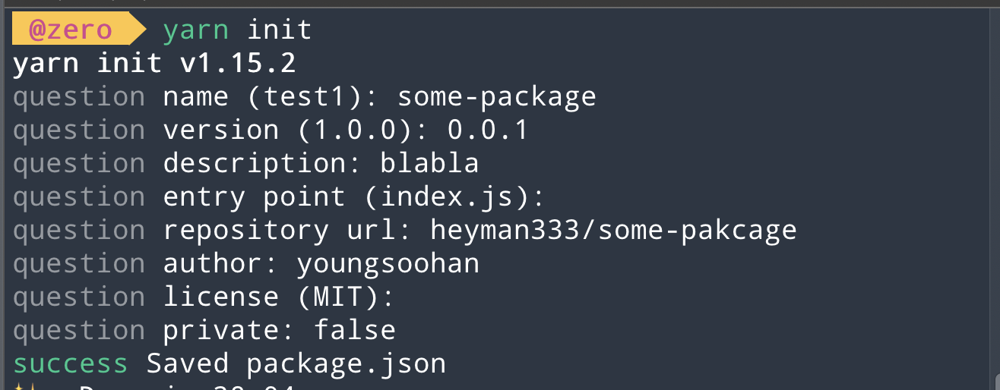

최근에 회사에서 사용하는 소스를 모듈화 해서 npm에 배포했습니다
[깃헙링크](https://github.com/heyman333/react-native-animated-numbers)

대단한 일은 아니지만 혹시 이런 일을이 어렵게만 느껴지시는 분들을 위해 포스트를 작성합니다. 이게 별로 어려운일이 아니라는 것을 많은 자바스크립트 개발자 분들이 아셨으면 좋겠습니다 🙃

## 1. pacakage.json 생성하기

먼저 프로젝트를 생성하기 위해 `yarn init` 또는 `npm init`을 실행해줍니다. 그러면 다음처럼 간단하게 어떤 내용으로 프로젝트 또는 패키지를 만들지 설정할 수 있습니다



그렇다면 위에 내용으로 `package.json`파일이 생성이 되고, 우리가 제작한 모듈을 npm에 배포하기 위해서는 다음과 같은 추가 정보가 더 필요합니다.

```json
{
  "name": "react-native-animated-numbers",
  "version": "0.0.3",
  "main": "index.js",
  "typings": "index.d.ts",
  "description": "Module that shows number changes through simple animation",
  "scripts": {
    "lint": "yarn eslint .",
    "test": "echo \"Error: no test specified\" && exit 1"
  },
  "repository": {
    "type": "git",
    "url": "git+https://github.com/heyman333/react-native-animated-numbers"
  },
  "keywords": [
    "react-native",
    "react-native-component",
    "react-component",
    "ios",
    "android",
    "react",
    "animation",
    "text",
    "number"
  ],
  "author": "youngsoohan",
  "license": "MIT",
  "bugs": {
    "url": "https://github.com/heyman333/react-native-animated-numbers/issues"
  },
  "homepage": "https://github.com/heyman333/react-native-animated-numbers/blob/master/README.md",
  "peerDependencies": {
    "react": ">=16.8.0",
    "react-native": ">=0.59"
  },
  "devDependencies": {
    "eslint": "^7.4.0",
    "eslint-plugin-react": "^7.20.3"
  }
}
```

- typings: typescript 사용을 위한 타입 정의 파일 지정
- scripts: 자주 사용하는 cli명령을 지정
- keywords: https://www.npmjs.com/ 내에 키워드를 명시하기 이해 사용
- peerDependencies: peerDependencies를 명시 (명시된 모듈 위에서 동작함을 명시)
- devDependencies: devDependencies를 명시 (해당 모듈을 개발하기 위해서 다음 모듈이 필요함을 명시)

여기까지 완성이 되면 npm에 배포할 기본 자격은 맞춰졌습니다

## 2. index.js 파일에 내가 만든 소스 작성하기

이제 실질적으로 사용되는 소스를 여기에 작성하시면 됩니다. 제가 오래전에 만든 간단한 라이브러리의 소스를 옮겨보곘습니다.

### index.js

```js
import { isIphoneX } from 'react-native-iphone-x-helper'
import { Platform, StatusBar, Dimensions } from 'react-native'

const { height, width } = Dimensions.get('window')
const standardLength = width > height ? width : height
const offset =
  width > height ? 0 : Platform.OS === 'ios' ? 78 : StatusBar.currentHeight // iPhone X style SafeAreaView size in portrait

const deviceHeight =
  isIphoneX() || Platform.OS === 'android'
    ? standardLength - offset
    : standardLength

export function RFPercentage(percent) {
  const heightPercent = (percent * deviceHeight) / 100
  return Math.round(heightPercent)
}

// guideline height for standard 5" device screen is 680
export function RFValue(fontSize, standardScreenHeight = 680) {
  const heightPercent = (fontSize * deviceHeight) / standardScreenHeight
  return Math.round(heightPercent)
}
```

타입스크립트를 지원한다면 아래와 비슷한 식으로 package.json에 정의된 대로 type을 정의해주시면 됩니다

### index.d.ts

```ts
declare function RFPercentage(percent: number): number
declare function RFValue(value: number, standardScreenHeight?: number): number

export { RFPercentage, RFValue }
```

## 3. npmignore 작성하기

npmignore은 깃헙등 레포지토리에는 표시가 되지만 실제 다운로드 되는 `node_modules` 에는 다운로드가(배포가) 되지 않도록 제외시킬 목록을 정의하는 파일입니다.
보통은 `.git`이 포함되며 `images` 또는 예지 프로젝트 폴인 `examples` 등이 포함됩니다 파일명은 `.npmignore`로 숨김처리 하여 만듭니다

```
ExampleProject
images
.circleci
.git
```

## 4. npm 계정 만들기

## 5. 그 외 있으면 좋은 것들

```

```
