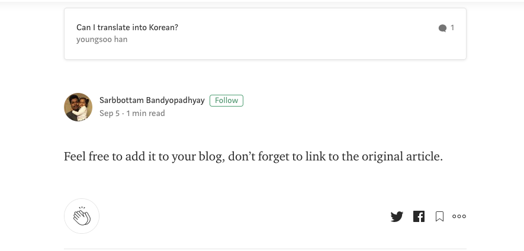
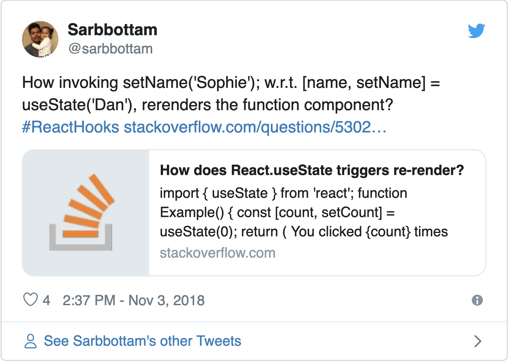
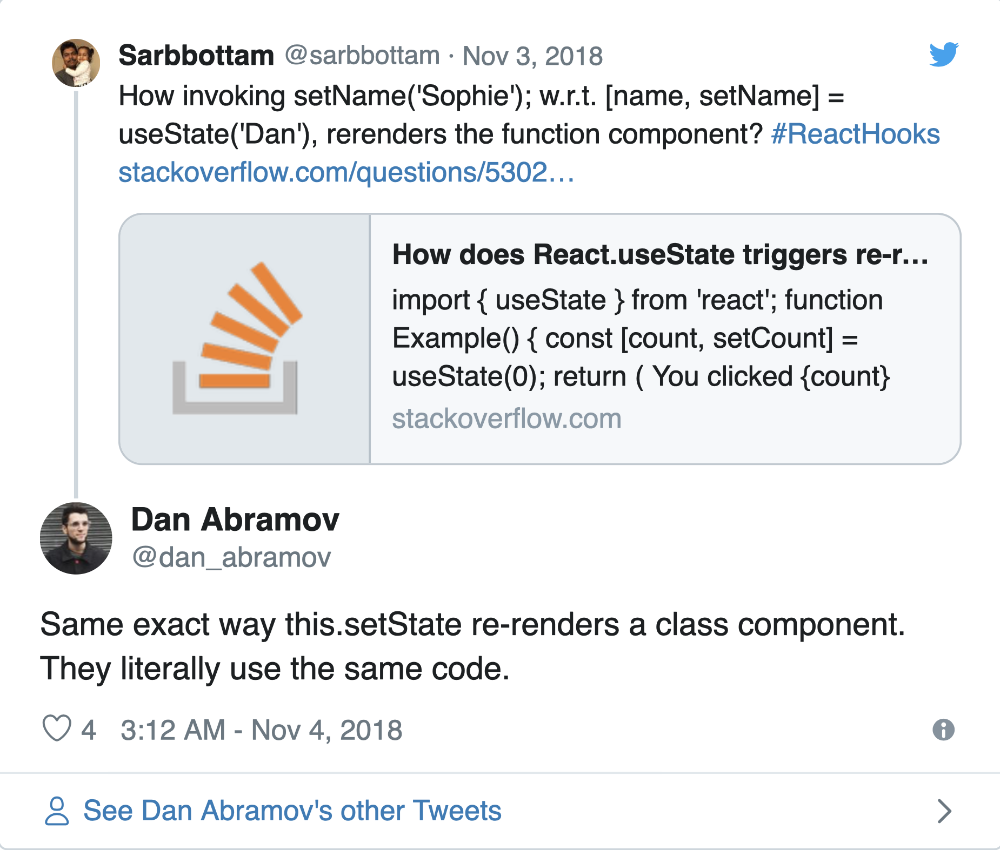
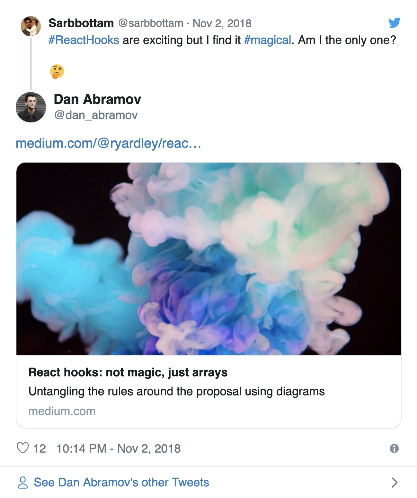

다음 글은 `react-hooks`의 동작원리를 알아보기 위해 원작자 [Sarbbottam Bandyopadhyay](https://medium.com/@sarbbottam) 의 글을 번역한 글입니다

<figure>
  
</figure>

> Thank you! Sarbbottam

원본은 [medium](https://medium.com/swlh/how-does-react-hooks-re-renders-a-function-component-cc9b531ae7f0)에서 확인 하실 수 있습니다

⚠️ 이 글은 `react-hooks`를 어떻게 활용하가에 대한 글이 아닙니다. 이미 `react-hooks`를 설명하는 많은 훌륭한 자료들이 많습니다. 이 포스트에서는 `react-hooks` 의 매커니즘, 화면 뒤에서 `react-hooks`가 작동하는 방법, `function component`의 state 를 유지 하는방법, `function component` 를 다시 렌더링 하는 방법에 대한 이해를 설명하려고 합니다. `react` 또는 `react-hooks` 시작하기 위해 자료를 찾고 있다면 공식 문서부터 시작하는 것이 좋습니다. [the official React documentation](https://reactjs.org/docs/getting-started.html).

참고로, 저는 `react-hooks`의 실제 구현에는 익숙하지 않습니다. `react-hooks` 의 실제 구현이 이 글에서 설명한 접근법과 정확하지는 일치 하지 않지만 비슷할 것이라고 생각합니다.

<hr/>

<figure>
  
</figure>

> Photo by<a href="https://unsplash.com/@bundo?utm_source=unsplash&utm_medium=referral&utm_content=creditCopyText">Bundo Kim</a> on <a href ="https://unsplash.com/search/photos/hooks?utm_source=unsplash&utm_medium=referral&utm_content=creditCopyText">Unsplash</a>

더 이상 고민하지 말고 시작합시다.

`react-hooks` 는 2018 년 10 월 25 일 React Conf에서 공개적으로 발표되었습니다. 저는 `react-hooks`를 사용하여 `function component` 의 state를 유지할 수 있다는 사실에 놀랐습니다. 처음부터 저는 그것에 매료되었지만, 그것은 저에게 마법처럼 보였습니다. 저는 `hook`에 의해 반환 된 함수를 호출하는 것이 어떻게 다시 컴포넌트를 렌더링을 하는지 이해할 수 없었습니다. 그때 코드를 파고 들었지만 아무런 의미가 없었고 제가 생각할 수 있는 최선을 다했으며 StackOverflow 질문을 올렸습니다.

> <a href="https://stackoverflow.com/questions/53024488/how-does-react-usestate-triggers-re-render?source=post_page-----cc9b531ae7f0----------------------">javascript - How does React.useState triggers re-render? - Stack Overflow</a>

게시물에 답글이 있지만 이해 할 수 없었습니다. 며칠 후, StackOverflow 게시물을 해시 태그 `#ReactHooks`로 트윗했고, 이는 제가 다음으로 할 수 있는 가장 좋은 행동이라고 생각했습니다.

<a href ="https://twitter.com/sarbbottam/status/1058593868046774272?ref_src=twsrc%5Etfw%7Ctwcamp%5Etweetembed&ref_url=https%3A%2F%2Fcdn.embedly.com%2Fwidgets%2Fmedia.html%3Ftype%3Dtext%252Fhtml%26key%3Da19fcc184b9711e1b4764040d3dc5c07%26schema%3Dtwitter%26url%3Dhttps%253A%2F%2Ftwitter.com%2Fsarbbottam%2Fstatus%2F1058593868046774272%26image%3Dhttps%253A%2F%2Fi.embed.ly%2F1%2Fimage%253Furl%253Dhttps%25253A%25252F%25252Fpbs.twimg.com%25252Fprofile_images%25252F551941907350163457%25252FTAaQFKXs_400x400.jpeg%2526key%253Da19fcc184b9711e1b4764040d3dc5c07">
<figure>
  
</figure>
</a>

`#ReactHooks` 해시 태그를 사용하는 것이 Dan Abramov의 관심을 끈 것 같았습니다. 그는 `re-rendering` 메커니즘이 Class Component와 동일하다고 답변했습니다.

<a href="https://twitter.com/dan_abramov/status/1058784045658791936?ref_src=twsrc%5Etfw%7Ctwcamp%5Etweetembed&ref_url=https%3A%2F%2Fcdn.embedly.com%2Fwidgets%2Fmedia.html%3Ftype%3Dtext%252Fhtml%26key%3Da19fcc184b9711e1b4764040d3dc5c07%26schema%3Dtwitter%26url%3Dhttps%253A%2F%2Ftwitter.com%2Fdan_abramov%2Fstatus%2F1058784045658791936%26image%3Dhttps%253A%2F%2Fi.embed.ly%2F1%2Fimage%253Furl%253Dhttps%25253A%25252F%25252Fpbs.twimg.com%25252Fprofile_images%25252F1096807971374448640%25252FrVCDhxkG_400x400.png%2526key%253Da19fcc184b9711e1b4764040d3dc5c07">
<figure>
  
</figure>
</a>

답변이 도움이되었지만 `rendering`을 트리거하는 방법을 이해할 수 없었습니다. 그리고 React의 Class Component가 `this.setState` 를 호출하면 다시 렌더링을 시작하는 방법을 보고 추론 했습니다.

📌 다음 예제를 봅시다.

```js
const { render, Component } = OverReact
class ExtendedComponent extends Component {
  constructor(props) {
    super(props)
    this.state = {
      counter: 0,
      name: 'foo',
    }
  }

  plusOne() {
    const { state: previousState } = this
    let { counter } = previousState
    counter = counter + 1
    this.setState(Object.assign(previousState, { counter }))
  }
  updateName(name) {
    const { state: previousState } = this
    this.setState(Object.assign(previousState, { name }))
  }

  render() {
    const { counter, name } = this.state
    console.log(`rendered, counter: ${counter}, name: ${name}`)
  }
}
// initial render
render(ExtendedComponent)
```

⚠️ 우리는 `React`가 아닌 `OverReact`의 `render`와 `Component`를 사용하고 있습니다. `OverReact`를 구현하고 `this.setState`를 호출하여 컴포넌트를 다시 렌더링하는 방법을 알아 봅니다. 또한 `ExtendedComponent`의 렌더링 함수는 HTML을 반환하지 않고, 현재 상태를 출력합니다.

💻 우리가 이미 알고있는 정보로 `render` 함수와 `Component Class`를 구현해 봅시다 :

- render 함수는 Component를 받아서 렌더링합니다.

- Component Class에는 this.props를 설정하는 생성자와 re-rendering을 트리거하는 setState 메소드가 있습니다.

```js
// extreamly simplified implementation
function render(Component) {
  // ToDo
  // 컴포넌트를 그린다
}
class Component {
  constructor(props) {
    this.props = props
  }
  setState(state) {
    this.state = state
    // ToDo
    // re-render를 트리거 한다
  }
}
OverReact = {
  render,
  Component,
}
```

`Component class`의 `OverReact.render` 함수와 `setState` 함수는 `ExtendedComponent`의 `render` 함수를 실행 할 수 있어야 합니다.

위의 지식으로 ToDos를 구현해 봅시다.

```js
// extreamly simplified implementation
function render(Component) {
  // 전달된 Component의 인스턴스를 생성한다
  const instance = new Component()
  // 인스턴스의 render method를 실행한다
  instance.render()
  // 인스턴스의 다른 메소드를 호출하기 위해
  // 인스턴스를 다시 리턴한다
  // 다음과 같이:
  // const instance = render(ExtendedComponent);
  // instance.someInstanceMethod();
  return instance
}
class Component {
  constructor(props) {
    this.props = props
  }
  setState(state) {
    this.state = state
    // 인스턴스의 render method를 실행한다
    this.render()
  }
}
OverReact = {
  render,
  Component,
}
```

이제 위의 구현을 IIFE (즉시 실행 함수)로 래핑하여 렌더링 및 컴포넌트 구현을 캡슐화 하겠습니다.

```js
// extreamly simplified implementation
OverReact = (function() {
  function render(Component) {
    const instance = new Component()
    instance.render()
    return instance
  }
  class Component {
    constructor(props) {
      this.props = props
    }
    setState(state) {
      this.state = state
      this.render()
    }
  }
  return {
    render,
    Component,
  }
})()
```

위의 작업과 함께 우리는 다음처럼 `this.setState`의 호출이 `rendering`을 트리거한다는 것을 알 수 있습니다.

```js
OverReact = (function() {
  function render(Component) {
    const instance = new Component()
    instance.render()
    return instance
  }
  class Component {
    constructor(props) {
      this.props = props
    }
    setState(state) {
      this.state = state
      this.render()
      // 역주: Component를 extends하기 때문에 여기는 ExtendedComponent에서 직접 구현한 render()메소드가 됩니다
    }
  }
  return {
    render,
    Component,
  }
})()
const { render, Component } = OverReact
class ExtendedComponent extends Component {
  constructor(props) {
    super(props)
    this.state = {
      counter: 0,
      name: 'foo',
    }
  }

  plusOne() {
    const { state: previousState } = this
    let { counter } = previousState
    counter = counter + 1
    this.setState(Object.assign(previousState, { counter }))
  }
  updateName(name) {
    const { state: previousState } = this
    this.setState(Object.assign(previousState, { name }))
  }

  render() {
    const { counter, name } = this.state
    console.log(`rendered, counter: ${counter}, name: ${name}`)
  }
}
// 최초의 render
// 인스턴스는 OverReact.render method에 의해 반환 됩니다
const instance = render(ExtendedComponent)
// rendered, counter: 0, name: foo
instance.plusOne()
// rendered, counter: 1, name: foo
instance.updateName('bar')
// rendered, counter: 1, name: bar
instance.plusOne()
// rendered, counter: 2, name: bar
instance.updateName('baz')
// rendered, counter: 2, name: baz
instance.plusOne()
// rendered, counter: 3, name: baz
```

💻 위의 코드가 실제로 작동하는지 확인하려면이 [CodePen](https://codepen.io/sarbbottam/pen/ewBMva?editors=0010)을 참조해주세요

`setState`가 인스턴스에 액세스 할 수 있으므로 `instance.render()`를 호출하여 Component를 다시 렌더링 할 수 있음을 이해할 수 있습니다.

그러나 위 예제로 `hook`으로 반환 된 함수가 component에 액세스하고 다시 렌더링을 트리거하는 방법을 추론 할 수 있을까요?
저는 `closure` 가 어떤 역할을 할 수 있다고 생각했지만 완전히 이해하진 못했습니다.

## closure란 무엇인가?

함수에 선언 된 모든 변수는 해당 함수의 실행 범위 중에만 사용할 수 있습니다. 그러나 함수가 다른 함수를 반환하면
외부 함수의 실행이 완료된 후에도 [반환함수는 실행이 완료된 경우에도 반환함수 밖에 선언 된 변수에 접근 할 수 있습니다](https://medium.com/swlh/how-does-react-hooks-re-renders-a-function-component-cc9b531ae7f0)

## 왜 closure인가?

`closure`는 영구적인 메모리를 사용하지 않고 JavaScript 함수가 상태를 안전하게 유지할 수있는 유일한 방법입니다. `글로벌 변수`에 상태를 유지하는 것은 안전하지 않으며 누구나 `글로벌 변수`에 액세스 할 수 있으므로 결정적이지 않은 결과를 초래할 수 있습니다. 따라서 `closure`는 유일한 옵션이 될 수 있습니다.

## Closure 101

```js
function greet(salutation) {
  return function(noun) {
    // 비록 greet이 함수의 실행을 끝냈지만
    // salutation 변수는 계속 사용가능합니다
    console.log(`${salutation} ${noun}!`)
  }
}
const hello = greet('Hello')
const hi = greet('Hi')
hello('World') // Hello World!
hello('Universe') // Hello Universe!
hi('Venus') // Hi Venus!
hi('Mars') // Hi Mars!
```

제가 `react Hooks` 가 마법같다고 느껴진다고 tweet했을 때 Dan은 다른 좋은 글을 공유 해줬습니다.
[React hooks: not magic, just arrays](https://medium.com/@ryardley/react-hooks-not-magic-just-arrays-cd4f1857236e)

<a href="https://twitter.com/dan_abramov/status/1058346579835473922?ref_src=twsrc%5Etfw%7Ctwcamp%5Etweetembed&ref_url=https%3A%2F%2Fcdn.embedly.com%2Fwidgets%2Fmedia.html%3Ftype%3Dtext%252Fhtml%26key%3Da19fcc184b9711e1b4764040d3dc5c07%26schema%3Dtwitter%26url%3Dhttps%253A%2F%2Ftwitter.com%2Fdan_abramov%2Fstatus%2F1058346579835473922%26image%3Dhttps%253A%2F%2Fi.embed.ly%2F1%2Fimage%253Furl%253Dhttps%25253A%25252F%25252Fpbs.twimg.com%25252Fprofile_images%25252F1096807971374448640%25252FrVCDhxkG_400x400.png%2526key%253Da19fcc184b9711e1b4764040d3dc5c07">
<figure>
  
</figure>
</a>

[React hooks: not magic, just arrays](https://medium.com/@ryardley/react-hooks-not-magic-just-arrays-cd4f1857236e)은 `react-hooks`의 개념을 잘 설명했지만 구체적인
예제는 없었습니다.

그런 다음 [React Hooks Demystified](https://dev.to/kayis/react-hooks-demystified-2af6)를 찾았습니다. `react-hook`이 `state`를 유지 관리하고 `state`를 업데이트에서 component를 다시 렌더링하는 방법에 대한 훌륭한 글이었지만 사용법은 `react-hooks`의 사용법과는 상당히 다른 것처럼 보였습니다.

`react-hooks` 에 대한 이해를 설명한 몇개의 글을 읽었지만 React와 유사한 구현을 가지고 설명한 글은 없었습니다.

얼마 전에 저는 Ryan의 [React Boston presentation](https://www.youtube.com/watch?v=1jWS7cCuUXw&t=48)을 봤습니다. 발표에서 그는 `renderWithCrappyReactHooks` 함수를 구현해 `react-hooks`의 개념을 설명했지만, `renderWithCrappyReactHook`은 단일 구성 요소에 밀접하게 연결되었습니다. 하지만 저는 더 분리되고 재사용 가능한 구현을 찾고있었습니다.

그리고 최근에 [Deep dive: How do React hooks really work?](https://www.netlify.com/blog/2019/03/11/deep-dive-how-do-react-hooks-really-work/)를 찾았습니다. `react-hook`이 상태를 유지하는 방법을 이해하는 데 큰 도움이되었지만 `hook` 함수 내에서 `render`를 처리하지 않고, render 함수를 명시적으로 호출해줬기 때문에 `hook`이 `rendering`을 어떻게 트리거 하는지 설명하지는 않았습니다.

제 질문은 아직 해결되지 않은 채 남아 있었습니다. 궁금증을 갖고 있었지만 스스로 구현하지 않으려는 수동적인 자세로 해결책을 찾으려고 했고 [Deep dive: How do React hooks really work?](https://www.netlify.com/blog/2019/03/11/deep-dive-how-do-react-hooks-really-work/)는 저 스스로 무언가를 시험해 보라고 동기를 부여했습니다.

<hr/>

`react-hooks`가 소개 된지 8개월이 지났지만 여전히 그것이 화면 뒤에서 어떻게 동작하는지 몰랐습니다.

며칠 전, [StackOverflow](https://medium.com/swlh/how-does-react-hooks-re-renders-a-function-component-cc9b531ae7f0)에서 [jonas Wilms](https://stackoverflow.com/users/5260024/jonas-wilms)의 답변을 찾았고, 답변의 예제는 간단했지만 구현은 `react-hooks`의 사용법과 가장 가까워 보였습니다. 저는 마침내 이 답변에 기초 하여 집접 구현을 할 수 있었습니다. 감사합니다. Jonas. 🙏

## Hook은 어떨까?

📌 `function component`와 `hook`을 사용하여 이전에 공유한 Class Component를 구현해 봅시다

```js
const { render, useState } = OverReact
function Component() {
  const [counter, setCounter] = useState(0)
  const [name, setName] = useState('foo')

  function plusOne() {
    setCounter(counter + 1)
  }

  function updateName(name) {
    setName(name)
  }
  function render() {
    console.log(`rendered, counter: ${counter}, name: ${name}`)
  }

  return {
    render,
    plusOne,
    updateName,
  }
}
// initial render
render(Component)
```

⚠️ 우리는 `React`가 아니라 `OverReact`의 `State`를 사용하고 있고 `OverReact`를 재구현 할 것이며, `useState`에서 반환하는 함수를 호출하는 것이 어떻게 `function component`를 `re-rendering`하는 지 알아 볼 것입니다. 또한 위의 예에서 `function component`는 HTML을 반환하지 않고 `render`, `plusOne`, `updateName` 함수를 가지고 있는 객제를 반환할 것입니다. 이것은 구현을 상당히 단순화시켰고 제가 개념을 이해하는데 도움을 주었습니다.

💻 우리가 이미 알고있는 정보로 `render` 및 `useState` 함수를 구현해 봅시다 :

- render 함수는 Component를 받아서 렌더링합니다.
- useState 함수는 현재 state를 알고 있고, 현재 state 및 state를 업데이트하는 함수가 포함 된 배열을 반환합니다.
- useState에 의해 리턴 된 함수는 호출 될 때 컴포넌트를 자동으로 다시 렌더링합니다.

```js
// extreamly simplified implementation
function render(Component) {
  // ToDo
  // render the Component
}
function useState(initialState) {
  // ToDo
  // derive currentState
  let currentState

  function setState(newState) {
    // ToDo
    // update currentState with newState
    // rerender the component
  }
  return [currentState, setState]
}
OverReact = {
  render,
  useState,
}
```

`OverReact.render` 함수는 Component 함수가 반환 한 객체에서 `render` 메서드를 호출합니다. `setState`는 Component 함수에 접근 할 수 있어야하므로 `OverReact.render 함수`를 전달하여 `rendering`을 트리거 할 수 있습니다.

Component 함수는 `useState` 또는 `setState` 함수로 전달되지 않습니다. 따라서 `setState 함수`에서 Component 함수에 접근 할 수 있도록 Component 함수 를 외부에 저장해야합니다.

위의 지식으로 ToDos를 구현해 봅시다.

```js
// extreamly simplified implementation

// 우리는 Component function을 이 context에 저장 할 것입니다
// 따라서 setState에서 다음 context에 접근 할 수 있습니다
let context = {}
// 이 callId를 사용하여 useState 호출 상태를 유지합니다.
let callId = -1
function render(Component) {
  // Component function을 context에 저장합니다
  context.Component = Component
  // Component function을 실행합니다
  const instance = Component()
  // Component를 render합니다
  instance.render()
  // render가 실행될 때마다 callId를 reset해 줍니다
  callId = -1
  // 인스턴스를 context에 추가하고 반환 합니다.
  // 다음처럼 인스턴스의 다른 메소드를 호출하기 위해서
  // const context = render(Component);
  // context.instance.someInstanceMethod();
  context.instance = instance
  return context
}
function useState(initialState) {
  // context에 훅이 존재 하지 않으면 hooks 배열을 만들어줍니다.
  if (!context.hooks) {
    context.hooks = []
  }

  // callId를 증가시킵니다
  // callId는 initialState를 저장하는데 사용됩니다
  // 또는 useState를 사용하기 위해 존재하는 state를 검색하는 용도로 사용합니다
  callId = callId + 1

  const hooks = context.hooks
  // currentState를 도출합니다
  const currentState = hooks[callId] ? hooks[callId] : initialState
  // currentState를 저장합니다.
  hooks[callId] = currentState
  // closure의 실행
  const setState = (function() {
    // setState가 실행 될때 올바른 state가 업데이트 될 수 있도록
    // 현재 callId를 저장합니다
    const currentCallId = callId

    // 적절한 state를 업데이트 하고 OverReact.render를 실행하기 위해
    // currentCallId를 사용할 함수를 리턴합니다.
    return function(newState) {
      hooks[currentCallId] = newState
      render(context.Component)
    }
  })()
  return [currentState, setState]
}
OverReact = {
  render,
  useState,
}
```

🤟역주 :

- 다음처럼 `useState`가 여러개 실행되는 상황 때문에 `callId` 와 같은 개념이 필요합니다
- 다음에 대한 개념은 [React hooks: not magic, just arrays](https://medium.com/@ryardley/react-hooks-not-magic-just-arrays-cd4f1857236e)에서 더 자세히 확인 가능합니다

```js
const [firstName, setFirstName] = useState('Rudi') // callId: 0
const [lastName, setLastName] = useState('Yardley') // callId: 1
```

이전의 `OverReact` 처럼 IIFE (즉시 실행 함수)를 통해 기능을 캡슐화 하겠습니다.

```js
// extreamly simplified implementation
OverReact = (function() {
  let context = {}
  let callId = -1
  function render(Component) {
    context.Component = Component
    const instance = Component()
    instance.render()
    callId = -1
    context.instance = instance
    return context
  }
  function useState(initialState) {
    if (!context.hooks) {
      context.hooks = []
    }

    callId = callId + 1

    const hooks = context.hooks
    const currentState = hooks[callId] ? hooks[callId] : initialState
    hooks[callId] = currentState
    const setState = (function() {
      const currentCallId = callId

      return function(newState) {
        hooks[currentCallId] = newState
        render(context.Component)
      }
    })()
    return [currentState, setState]
  }
  return {
    render,
    useState,
  }
})()
```

하나로 합쳐 봅시다 :

```js
OverReact = (function() {
  let context = {}
  let callId = -1
  function render(Component) {
    context.Component = Component
    const instance = Component()
    instance.render()
    // render가 끝날때마다 callId를 리셋합니다
    callId = -1
    // OverReact.render밖에서 instance.render가 실행되지 않도록 다음을 실행합니다
    delete instance.render
    context.instance = instance
    return context
  }
  function useState(initialState) {
    if (!context) {
      throw new Error('hooks can not be called with out a rendering context')
    }
    if (!context.hooks) {
      context.hooks = []
    }

    callId = callId + 1

    const hooks = context.hooks
    const currentState = hooks[callId] ? hooks[callId] : initialState
    hooks[callId] = currentState
    const setState = (function() {
      const currentCallId = callId
      return function(newState) {
        hooks[currentCallId] = newState
        render(context.Component)
      }
    })()

    return [currentState, setState]
  }
  return {
    render,
    useState,
  }
})()
const { render, useState } = OverReact
function Component() {
  const [counter, setCounter] = useState(0)
  const [name, setName] = useState('foo')

  function plusOne() {
    setCounter(counter + 1)
  }

  function updateName(name) {
    setName(name)
  }
  function render() {
    console.log(`rendered, counter: ${counter}, name: ${name}`)
  }

  return {
    render,
    plusOne,
    updateName,
  }
}
// 최초의 render
// context는 OverReact.render method에 의해 반환 됩니다
const context = render(Component)
// rendered, counter: 0, name: foo
context.instance.plusOne()
// rendered, counter: 1, name: foo
context.instance.updateName('bar')
// rendered, counter: 1, name: bar
context.instance.plusOne()
// rendered, counter: 2, name: bar
context.instance.updateName('baz')
// rendered, counter: 2, name: baz
context.instance.plusOne()
// rendered, counter: 3, name: baz
```

이제 `react-hooks`가 반환 한 함수를 호출하면 `rendering`이 트리거되도록 구현 했습니다  
💻 위의 코드가 작동하는지 확인하려면 [CodePen](https://codepen.io/sarbbottam/pen/WqozMa)을 참조하십시오.

## 결론

위는 `react-hooks`의 정확한 구현은 아닙니다. 저는 좀 더 이해하기 쉽게 인터페이스를 약간 수정하여`react-hooks` 인터페이스와 비슷하게 구현하려고 했습니다. 만약 당신이 `react-hook`이 어떻게 `rendering`을 트리거 하는지 궁금했다면
이 글이 도움이 되었길 바랍니다. 그리고 자유롭게 여러분의 생각을 적어주세요

위의 구현은 대부분의 `react-hooks` 사례를 처리 할 때 완벽하지는 않으며 `react` 또는 `react-hooks`를 다시 구현하지도 않을 것입니다. react 팀은 이미 훌륭한 일을 해냈습니다. react 팀이 끊임없이 한계를 뛰어 넘어 개발자로 하여금 최신 웹 응용 프로그램을보다 쉽게 구축, 재사용 및 유지 관리 할 수있게 해준 것은 놀라운 일입니다.

제가 `react-hooks`의 기능적 매커니즘에 대해 이해 할 수 있도록 질문에 대한 답변, 블로그 게시물, 프리젠테이션을 통해 도움을 준 [Dan](https://twitter.com/dan_abramov/status/1058784045658791936), [Rudi](https://medium.com/@ryardley/react-hooks-not-magic-just-arrays-cd4f1857236e), [Kayis](https://dev.to/kayis/react-hooks-demystified-2af6), [Ryan](https://www.youtube.com/watch?v=1jWS7cCuUXw&t=48), [Swyx](https://www.netlify.com/blog/2019/03/11/deep-dive-how-do-react-hooks-really-work/) 및 [Jonas](https://stackoverflow.com/questions/53895455/how-does-a-mechanism-behind-react-hooks-work#answer-53895655)에게 감사의 말을 전합니다.

마지막으로 제 솔루션을 구축한 [StackOverflow 답변](https://medium.com/swlh/how-does-react-hooks-re-renders-a-function-component-cc9b531ae7f0)에 대해 [jonas Wilms](https://stackoverflow.com/users/5260024/jonas-wilms)에게 무척 감사하고, 이 글을 읽고있는 여러분에게도 감사합니다. ☕️
