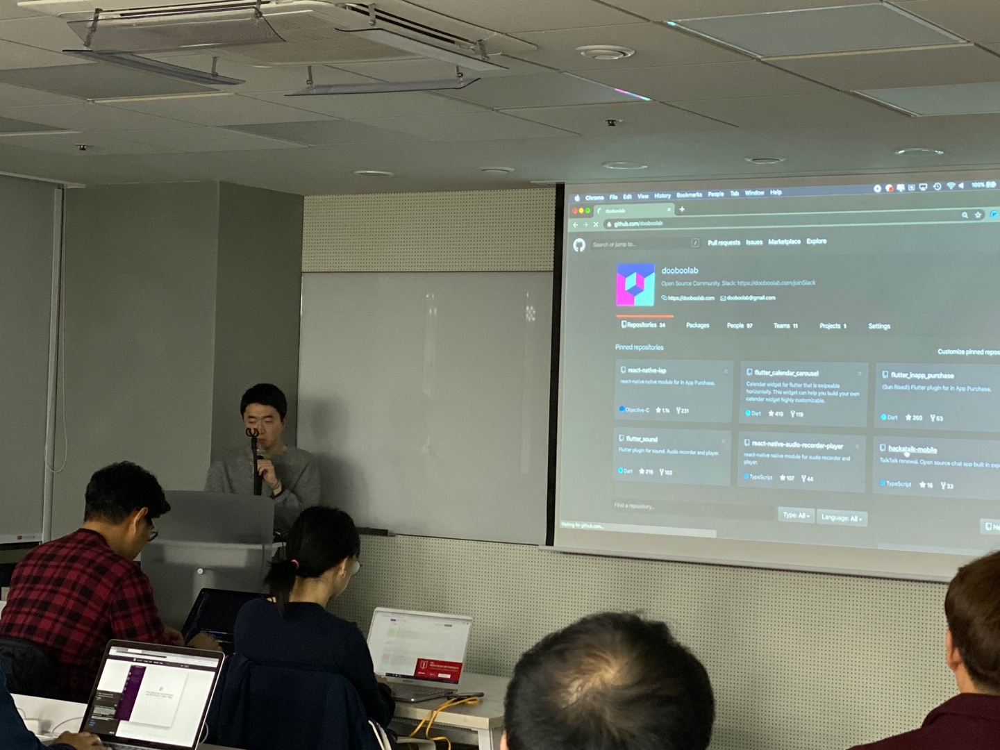
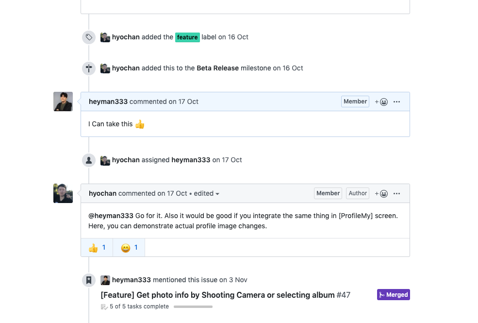
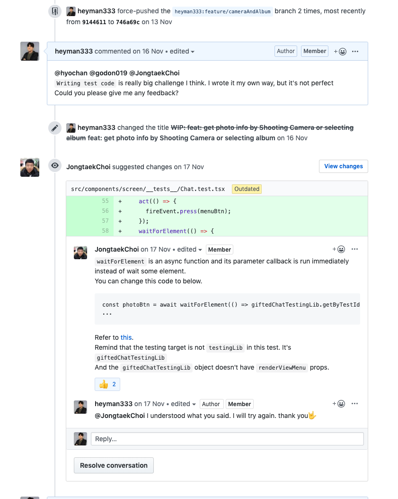
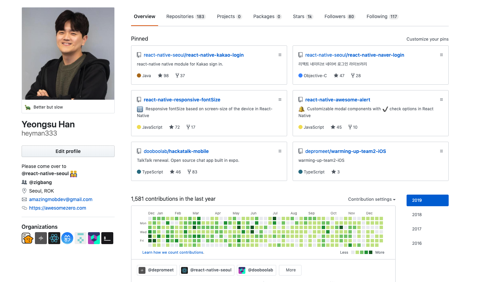

<i>제가 운영진으로 있는 React Native Seoul 미디엄에 올린글을 옮겼습니다</i>

몇 년 전, 리액트네이티브 서울에 처음 나갔을 때 약 열 명 정도가 모여 “오픈소스 만들어보자!” 하고 이거 만들까 저거 만들까 고민했던 기억이 있습니다. 그때까지만 해도 밋업 한번에 약 40명이 넘게 오는 큰 모임이 될 거라고 생각 못했는데 운영진분들의 노력에 큰 성과를 낼 수 있었습니다. 불현듯 19년을 돌아보며 내가 어떻게 살았는지 어떻게 개발을 했는지 생각하다가 모임과 모임의 모든 분들께 감사함을 느껴 “나는 리액트네이티브 서울에서 무엇을 배우고 느꼈는가” 에 대해서 적어보려고 합니다.

<figure>
  
</figure>

> 프로젝트를 소개하는 두부랩 창시자 효찬님

# 개발실력과 다른사람의 생각을 적극적으로 수용하는 방법

1. React 와 React-Native

우리 모임은 이름 그대로 리액트와 리액트네이티브 그리고 관련된 기술을 연구하고 학습하는 모임입니다. React Hooks, graphQL, apollo , test code , typescript , git , jest 제가 몰랐던 것들을 이 모임에서 열심히 공부하고 배웠다고 생각하는 키워드만 나열해도 대충 이 정도인 거 같네요. 위에 언급한 단어를 보면 흔히말하는 힙한 기술, 리액트 개발자라면 한 번쯤은 도전해보고 싶은 기술들입니다. 저는 이 모임에서 이런 기술을 사용하고 배울 수 있었습니다. 아마 회사에만 있었다면 꿈도 못 꿨겠죠?

2. 코드리뷰

리액트네이티브 서울에서 학습은 보통 밋업을 통한 기술공유 그리고 공통 프로젝트를 진행하면서 스스로의 학습과 코드리뷰를 통해 진행됩니다. 저는 평소에 배우고 싶었던 테스트 코드를 공부하기 위해 현재 모임에서 진행하고 있는 hackatalk (https://github.com/dooboolab/hackatalk-mobile) 프로젝트에 참여해서 열심히 이슈를 찾았습니다.

<figure>
  
</figure>

> 나 이거 할래!

그리고 열심히 코드리뷰를 받았죠. 모르는게 있으면 이렇게 멋진 개발자분들께서 친절하게 알려주십니다

<figure>
  
</figure>

> 감사합니다 종택님!

물론 슬랙을 통해서도 질문을 올릴 수도 있구요

위에서 봤듯이 전 모르는게 있으면 제 코드를 리뷰 해주시는 분들께 여쭤봤습니다. 테스트코드는 외국에서는 일반적인 개발방법이지만 우리나라에서는 아직 보편화되지는 않았기 때문에 제가 원하는 케이스의 레퍼런스를 찾는건 쉽지 않았기 때문이죠

이런식으로 코드리뷰를 받다보니 어느새 코멘트가 <strong>35개</strong>가 달렸습니다. 코멘트가 많아지면 불편함을 느낄 수도 있지만 오히려 이 프로젝트에서는 코멘트가 많아질수록 많이 배울 수 있기 때문에 왠지 모르는 뿌듯함이 생겼습니다(회사일이 아니라 부담도 없죠. 머지 안되면 어때 그래도 배울 수 있잖아요?)

이런 마음으로 코드리뷰를 받아들이니 자연스럽게 회사에서 받는 코드리뷰에도 긍정적인 마음으로 참여하게 되고 다른 개발자의 생각을 적극적으로 수용할 수 있는 힘이 커졌습니다. 더불어 얼마전에 마스(Mars) 님이 번역해주신 글(https://link.medium.com/XOLS91nLz2)처럼 “내가 좋은 코드”가 아니라 “남이 보고 이해할 수 있고 협업 가능한 코드”를 작성하는데 도움이 될 수 있었습니다.

(오픈소스 활동은 모두 영어로 진행하니 영어 공부는 덤으로 됩니다…🙌)

# 겸손한 마음과 학습욕구

저는 개발경력이 3년이 채 안 되는 쥬니어개발자입니다. (시니어 개발자가 될 날이 올지도 모르겠습니다… ㅎㅎ) 모임에는 저처럼 경력이 없는 개발자분도 오시고 개발경력이 많으신 분, 기업의 CTO 분들도 오십니다. 이런 분들이 항상 열심히 하시고, 열린마음으로 더 배우려고 하시고, 적극적으로 지식을 공유하려 하는 모습을 보고 강한 동기 부여를 받는일은 어떻게 보면 개발자로서 당연한 얘기일 것 같습니다.

회사 일에만 너무 몰두해서 살다보면 매너리즘에 빠지기 쉬운데 밋업(Meetup)에서 만난 분들의 마인드와 노력은 저에게 많은 자극을 주었습니다

이렇게 모임에는 사람으로서 개발자로서 좋은분들이 많이 계십니다 😎

<figure>
  
</figure>

리액트네이티브 서울에서 나름 활동을 열심히 하다보니 레포의 스타(Star)수와 커밋이 많아지기도 했지만 hackatalk (https://github.com/dooboolab/hackatalk-mobile) 프로젝트와 두부랩 (https://github.com/dooboolab)에 의미있는 커밋과 컨트리뷰트를 하면서 그리고 react-native-kakao-login과 react-native-naver-login을 maintain하기 시작하면서 새내기 오픈소스 개발자가 될 수 있었습니다.

또 개발자로서 이전보다 좋은 평가와 기대를 받을 수 있게 되었으며 오픈소스에 기여하는 연습을 통해 다른 오픈소스에도 부담없이 PR을 보낼 수 있었습니다.

덕분에 평소에도 Merge commit만 보다 Rebase를 더 선호하게 되었네요 😂

# 자신감

개발자로서 항상 겸손한 마음으로 새로운 것을 배우기 위해 노력하는 것도 중요하지만 자신감도 이 못지않게 중요하다고 생각합니다

밋업에서 처음 개발 활동을 시작했을때만해도 ‘내가 이 사람들을 따라 갈 수 있을까?’, ‘왜 나만 모르는 거 같지’라는 생각이 많았는데 하나하나 주변사람들의 도움을 통해 문제를 해결 할 수 있었고 ‘하니까 되는구나’, ‘진짜 모르겠으면 도움을 청하자’라는 마음으로 문제에 접근하니 생각보다 쉽게 해결되는 일이 많았습니다

# 2020년을 함께할 개발자분들에게

나말고 다 잘하는 것처럼 보여도 겁먹지 마세요! 생각보다 여러분은 여러분을 너무 과소평가 하고 있을 수도 주변멤버를 과대평가 하고 있을 수도 있습니다

성장하고 싶다면 열심히 질문하고 친해지세요! 리액트네이티브 서울에는 못한다고 뭐라고 할 사람도 전혀 없고, PR이 길어진다고, 코드를 못짠다고 뭐라고 할 사람도 절대 없습니다

저희는 그냥 개발하는 것을 좋아하고 모여서 지식을 공유하고 서로 성장하는 모습에 박수쳐줄 수 있는 사람들이니까요.

많은 개발자 분들 환영합니다 😀

마지막으로 한해동안 모임을 위해 노력하신 모든 운영진분들에게 감사한 마음을 전합니다.

# 참고

미디엄 주소: https://medium.com/react-native-seoul  
밋업참여: https://www.meetup.com/ko-KR/react-native-seoul/
