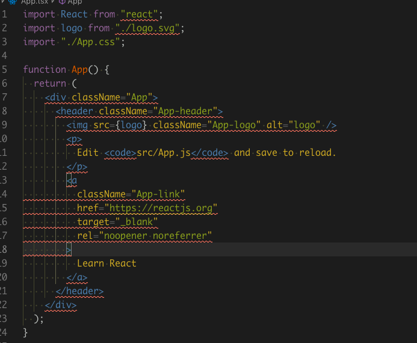

React 프로젝트를 시작할때마다 애먹이는 typescript 개발환경 설정 여기서 정리합니다!

※ code editor 는 `vscode` 를 기본으로 합니다  
※ `create-react-app`으로 생성된 웹프로젝트를 기준으로 설명합니다  
※ typescript 관련 모듈을 전역으로 설치 하지 않고 프로젝트 단위에서 설정합니다

# typescript & eslint 설치

`typescript`를 사용하기 위해서는 `컴파일러`가 필요하고  
작성한 코드를 `lint` 하기 위해서 `eslint`를 설치해줘야 합니다

<i>최신의 `create-react-app`프로젝트에는 `eslint`가 내장되어 설치가 불필요합니다</i>

- `yarn add --dev typescript`
- `yarn add --dev eslint`

# .eslintrc.js 파일 설정

여기서는 작성하는 모든 파일에 대한 lint 옵션을 설정해줍니다  
프로젝트 루트에 파일(`.eslintrc.js`)을 생성합니다

예시:

```js
module.exports = {
  extends: ['standard', 'prettier'],
  parser: '@typescript-eslint/parser',
  env: {
    browser: true,
    jest: true,
  },
  parserOptions: {
    ecmaVersion: 2017,
    sourceType: 'module',
  },
  rules: {
    'no-unused-vars': 0,
    'comma-dangle': ['error', 'always-multiline'],
    semi: [2, 'always'],
    'space-before-function-paren': ['error', 'never'],
    'no-new-object': 'error',
    'no-array-constructor': 'error',
    'space-before-function-paren': [
      'error',
      {
        anonymous: 'never',
        named: 'never',
        asyncArrow: 'always',
      },
    ],
  },
}
```

관련 설치 모듈:

```json
"@typescript-eslint/eslint-plugin": "^1.11.0",
"@typescript-eslint/parser": "^1.11.0",
"eslint": "^6.0.1",
"eslint-config-prettier": "^6.0.0",
"eslint-config-standard": "^12.0.0",
"eslint-plugin-import": "^2.18.0",
"eslint-plugin-node": "^9.1.0",
"eslint-plugin-promise": "^4.2.1",
"eslint-plugin-standard": "^4.0.0",
"typescript": "^3.5.2"
```

설명 :

`@typescript-eslint/parser`:  
`@typescript-eslint/eslint-plugin`:  
TypeScript ESTree 를 사용하여 ESLint 가 TypeScript 소스 코드를 lint 할 수 있게 하는 모듈

`eslint-config-prettier`:  
prettier 에서 관리 해 줄 수 있는 코드 스타일의 ESLint 규칙을 비활성화 시켜주는 모듈  
ESLint 는 자바스크립트 문법 관련된 것들만 관리하게 되고  
코드스타일 관련 작업은 prettier 가 담당합니다

`eslint` 설정파일을 어디서부터 만들어야 될지 모르겠다면

```shell
./node_modules/.bin/eslint --init
```

를 실행하고 제공되는 가이드에 따라  
가장 기본이 되는 설정파일을 생성할 수도 있습니다  
참고: [eslint-getting-started](https://eslint.org/docs/user-guide/getting-started)

# tsconfig.json 파일 설정

타입스크립트를 사용할때 어떤 조건으로 typescript 를 컴파일 할 지 설정하는 파일입니다  
프로젝트에 루트에 파일(`tsconfig.json`)을 만듭니다  
`vscode` 에서는 이 환경설정파일을 참고해서 개발자에게 에러메세지를 보여주고  
`tsc`를 통해 컴파일 할 때 기본옵션이 됩니다

팀 또는 개인의 여건에 맞게 설정하면 되겠습니다  
[사용가능한 옵션 (공식문서)](https://www.typescriptlang.org/docs/handbook/tsconfig-json.html#overview)

예시:

```json
{
  "compilerOptions": {
    "allowJs": false,
    "allowSyntheticDefaultImports": true,
    "esModuleInterop": true,
    "isolatedModules": true,
    "jsx": "react",
    "lib": ["es6"],
    "moduleResolution": "node",
    "noEmit": true,
    "strict": true,
    "target": "esnext",
    "module": "commonjs",
    "noImplicitAny": true,
    "removeComments": true,
    "preserveConstEnums": true,
    "sourceMap": true,
    "strictNullChecks": true,
    "skipLibCheck": true
  },
  "exclude": ["node_modules", "__tests__"]
}
```

여기까지 완료 되었으면 `create-react-app`으로 생성된 프로젝트 기준에서  
`App.js` 파일을 `App.tsx`로 확장자를 바꿔주겠습니다  
그러면 다음과 같이 `type 에러`가 뜨는 것을 확인 할 수 있습니다



에러 내용을 잘 확인해 보면 관련된 라이브러리(React 등)의 `type 정의 파일`을 찾을 수 없다는 에러인데요

기본적으로 react 모듈에는 타입스크립트를 사용하기 위한 `type 정의 파일`이 없기 때문에  
다음처럼 별도의 모듈들을 설치 해줘야 합니다

`yarn add --dev @types/react @types/react-dom`

설치 이후에 React 관련 라이브러리에서 type 을 찾을 수 없다는 에러는 모두 사라질 겁니다!

# 유용한 스크립트 파일 만들기

이제 `vscode`상에서 타입스크립트를 사용하기 위한 준비는 모두 끝났습니다!

다음은 명령창에서 직접 `타이핑 오류`를 찾고, `lint`를 실행해 보겠습니다  
이 동작들은 `husky`를 활용해서 코드를 커밋하거나 푸시하기 전에 실행하여 에러코드를  
사전에 방지하는 용도로 사용 할 수 있습니다 [husky.js 참고](https://github.com/typicode/husky)

```shell
"scripts": {
    ...
    "lint": "eslint src/**/**/*.ts && eslint src/**/**/*.tsx",
    "tsc": "tsc --noEmit"
  },
```

`typescript` & `eslint`를 `devDependency`에 설치 해뒀기 때문에  
`tsc` & `eslint`명령어를 바로 사용 할 수 있습니다.  
여기서는 컴파일 된 파일을 볼 필요가 없으니 `--noEmit`옵션을 주겠습니다

스크립트가 잘 동작하는지 확인하기 위해  
다음처럼 일부러 type 오류를 만들어서 명령어를 실행해 보겠습니다

`App.tsx` : <span style="color:red">정의 되지 않은 인터페이스 사용</span>

```tsx
import React from 'react'
import './App.css'

interface IProps {
  name: string
}

const App: React.FunctionComponent<IProps> = props => {
  const { name, age } = props
  return <div>hello react!</div>
}

export default App
```

```shell
> yarn tsc
```

```shell
src/App.tsx:9:17 - error TS2339: Property 'age' does not exist on type 'PropsWithChildren<IProps>'.

9   const { name, age } = props;
                  ~~~


Found 1 error.
```

typecheck 가 잘 되네요 🎉

<br />

`App.tsx` : <span style="color:red">상수에 새로운 값 할당</span>

```tsx
import React from 'react'
import './App.css'

interface IProps {
  name: string
}

const App: React.FunctionComponent<IProps> = props => {
  const { name } = props
  name = 100
  return <div>hello react!</div>
}

export default App
```

```shell
> yarn lint
```

```shell
/Users/zero/FC-REACT-8th-assignment/1st-tic-tac-toe/src/App.tsx
  10:3  error  'name' is constant  no-const-assign

✖ 1 problem (1 error, 0 warnings)
```

lint 도 잘 됩니다 🎉

이제 깔끔한 코드작성을 위한 준비는 모두 끝났습니다 👏

위 글은 어디까지나 개인적으로 개발환경을 구축하면서 얻은 노하우입니다  
잘못된 부분이나 수정할 부분이 있으면 댓글로 피드백 부탁드립니다!👍
